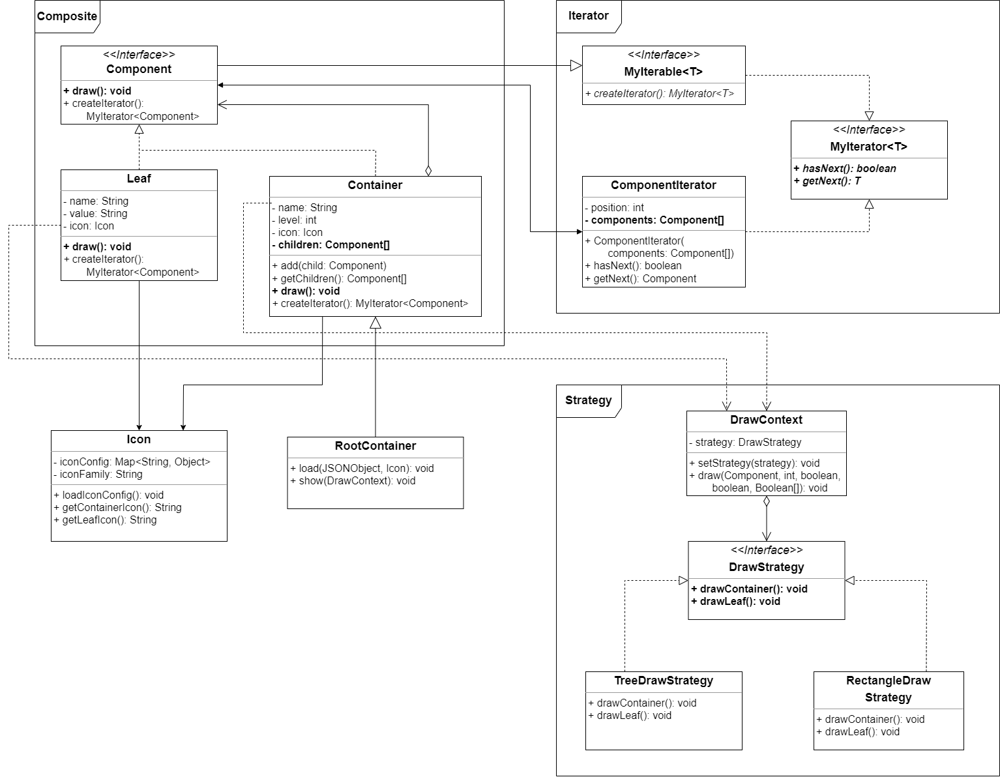
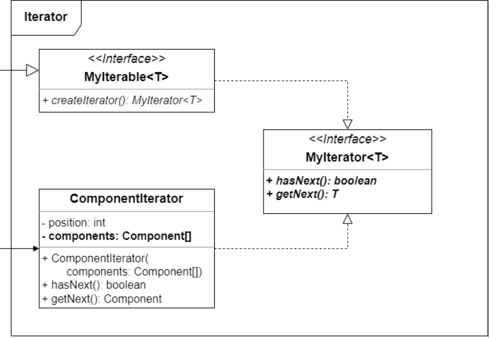
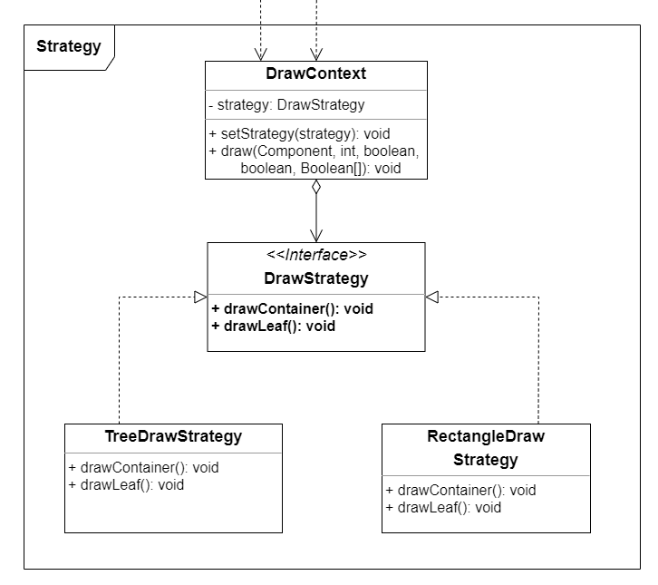
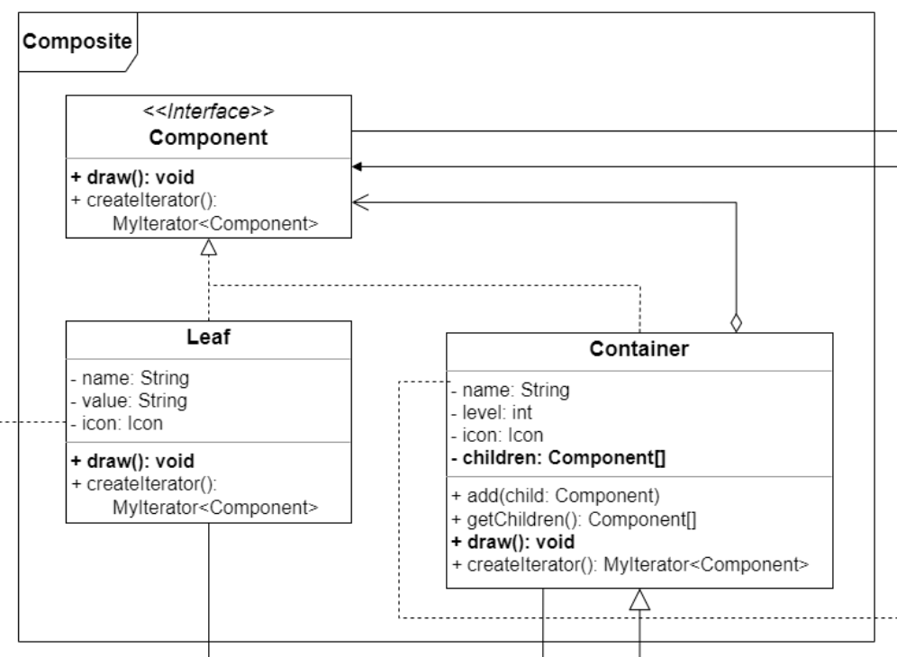
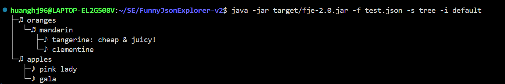
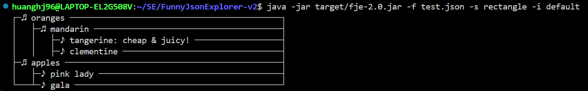
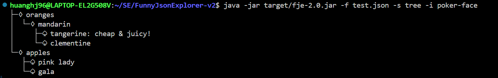
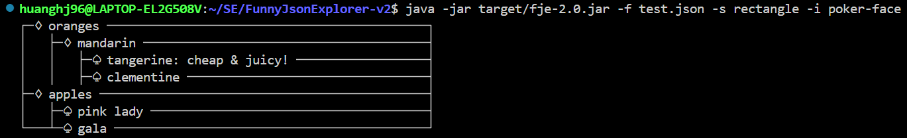

# FJE-v2 设计文档

## 一、项目概述

本项目实现了 Funny JSON Explorer（**FJE-v2**），一个 JSON 文件可视化的命令行界面小工具。项目基于 [FJE-v1](https://github.com/CyberSculptor96/Funny-Json-Explorer) ,使用了迭代器模式、策略模式和组合模式这三种设计模式。该系统可以根据不同的风格创建树形结构的节点，并以不同的图标族展示这些节点。

## 二、UML类图

UML 类图展示了各个类之间的关系和设计模式的应用。通过 UML 类图，可以直观地看到迭代器模式、策略模式和组合模式在项目中的实现。



## 三、设计模式使用说明

### 1. 迭代器模式（Iterator）

**作用：** 提供一种方法顺序访问一个聚合对象中的各个元素，而又不需要暴露该对象的内部表示。

**实现：**

- `MyIterator` 定义了一个接口，包含 `hasNext` 和 `getNext` 方法，用于遍历集合。
- `MyIterable` 定义了一个接口，包含 `createIterator` 方法，用于创建一个迭代器。
- `ComponentIterator` 实现了 `MyIterator` 接口，用于遍历 `Component` 集合。
- `Component` 接口继承了 `MyIterable` 接口，定义了 `draw` 和 `createIterator` 方法。
- `Container` 类实现了 `Component` 接口，表示一个容器节点，包含子组件并使用迭代器遍历子组件。



#### 2. 策略模式（Strategy）

**作用：** 定义一系列算法，把它们一个个封装起来，并且使它们可以互相替换。本模式使得算法可独立于使用它的客户而变化。

**实现：**

- `DrawStrategy` 定义了一个接口，包含 `drawContainer` 和 `drawLeaf` 方法，用于绘制不同的组件。
- `DrawContext` 类使用了策略模式，通过设置不同的绘制策略来绘制组件。
- `TreeDrawStrategy` 实现了 `DrawStrategy` 接口，定义了树形风格的绘制策略。
- `RectangleDrawStrategy` 实现了 `DrawStrategy` 接口，定义了矩形风格的绘制策略。



#### 3. 组合模式（Composite）

**作用：** 将对象组合成树形风格以表示“部分-整体”的层次结构。组合模式使得用户对单个对象和组合对象的使用具有一致性。

**实现：**

- `Component` 接口定义了组合对象的共同接口，包括 `draw` 方法。
- `Container` 类实现了 `Component` 接口，表示一个容器节点，可以包含子组件。
- `Leaf` 类实现了 `Component` 接口，表示一个叶子节点。
- `RootContainer` 类继承了 `Container` 类，包含 `load` 和 `show` 方法，用于加载 JSON 数据并显示树形风格。




## 四、可扩展性

### 1. 设置不同的风格

如果需要设置更多不同的风格，只需实现策略模式的接口 `DrawStrategy`，创建具体的风格策略，在该策略类中提供对应风格的绘制逻辑。然后，将新的风格策略加入 `DrawContext` 的 `draw` 方法中即可。

### 2. 配置不同的图标族

如果需要配置不同的图标族，只需修改 `src/resource/config.yaml` 配置文件，为容器和叶子节点分别添加对应的图标即可。该配置文件如下所示：

```yaml
default:
  container_icon: "♫"
  leaf_icon: "♪"
poker-face:
  container_icon: "♢"
  leaf_icon: "♤"
star:
  container_icon: "✧"
  leaf_icon: "✯"
```

## 五、运行截图

本 Java 项目使用 `maven` 作为依赖管理工具，通过 `maven package` 对项目进行编译构建，因此只需输入如下命令即可运行项目，得到 JSON 文件的可视化效果：

```shell
java -jar target/fje-1.0.jar -f <json file> -s <style> -i <icon family>
```

树形风格 + 默认图标族：



矩形风格 + 默认图标族：



树形风格 + `poker-face` 图标族：



矩形风格 + `poker-face` 图标族：



